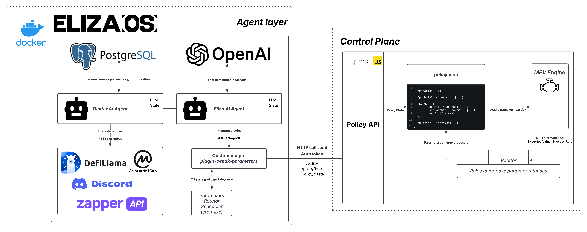

## Overview

The AI agent layer for the MEV research system: two ElizaOS agents, Eliza and
Dexter, plus a custom-built plugin that lets Eliza safely read and write the
sibling MEV bot's runtime config over HTTP, instead of touching its code or
execution path directly.

<a href="/images/agent-orchestration-architecture.png" target="_blank" rel="noreferrer"></a>
<p class="-mt-4 text-center text-xs text-muted">Click to open full size. Eliza calls the Policy API through the custom plugin to read/write policy.json; a rotator scheduler proposes bounded parameter changes back into the same file on a timer.</p>

## Problem

Tuning a MEV bot's parameters (gas tips, copy counts, trade caps, slippage
guards) by hand doesn't scale, but letting an LLM touch execution logic
directly is both too slow and too unpredictable given rollups' sub-second
block times. The system needed a way to let an agent adjust strategy behavior
safely and auditably, without giving it direct access to wallets or the
execution path.

## Approach

- Two-agent swarm on ElizaOS: Eliza is the controller, wired to the custom
  `plugin-tweak-parameters` plugin. Dexter is a read-only market-intel agent
  wired to four ElizaOS plugins, each covering a different slice of what a
  searcher needs to know before acting:
  - **`@elizaos/plugin-coinmarketcap`**: real-time token prices and
    natural-language price/trend queries ("BTC price and trend, please").
  - **`@elizaos/plugin-defillama`**: DEX and DeFi market data, TVL, and yield
    info, used to surface new or active pairs and gauge chain-level fee/volume
    "heat" (a proxy for where MEV activity is picking up).
  - **`@elizaos/plugin-zapper`**: portfolio tracking and DeFi analytics across
    50+ networks via GraphQL, used to check LP adds/pulls and liquidity
    rotation on watched pools.
  - **`@elizaos/plugin-discord`**: two-way chat and alerting, so Dexter can be
    dropped into a Discord channel and asked questions directly, confirmed
    working end to end by messaging it in Discord and getting live replies
    back.
- `plugin-tweak-parameters` exposes `GET`/`SET`/`BULK_SET` actions that map
  natural-language commands ("set spam N_FRONT to 3") to signed HTTP calls
  against the MEV bot's Policy API, never touching the bot's process
  directly:

  ```typescript
  const res = await fetch(`${base}/policy`, {
    method: "POST",
    headers: {
      "Content-Type": "application/json",
      ...(token ? { Authorization: `Bearer ${token}` } : {}),
    },
    body: JSON.stringify({ scope: "guards", key, value }),
  });
  ```
- A `RotationSchedulerService` runs on an interval (`ROTATE_PERIOD_MS`),
  calling `/policy/rotate_once` per MEV strategy (spam, sandwich) so the bot's
  own rules can propose bounded parameter tweaks even without a human
  prompting the agent.
- Dockerized stack: Postgres (pgvector) for agent memory/state plus the
  ElizaOS app container, with healthchecks and `host.docker.internal` wiring
  so the containerized agent can reach the Policy API running on the host.
- Unit, integration, and Cypress e2e tests for every action, plus dedicated
  tests for plugin build order and character/plugin ordering, since ElizaOS
  is picky about the order plugins load in.

## Findings

- Keeping the agent behind an HTTP API with a bearer token, rather than
  giving it direct access to the bot's process or database, means a
  prompt-injected or just wrong LLM output at worst sends a malformed
  request the Policy API can reject or clamp (policy.json's own min/max/step
  bounds), not something that can corrupt state or touch a wallet.
- Natural-language-to-command parsing needed several regex fallbacks
  (`policy set guard KEY VALUE`, `set KEY to VALUE`, `set KEY VALUE`) since
  the LLM doesn't always reproduce the exact syntax from its own system
  prompt, even when told to.
- Plugin load order was a recurring source of bugs: ElizaOS loads plugins in
  list order, and some (SQL, bootstrap) need to load before or after others.
  That ended up needing its own dedicated test
  (`character-plugin-ordering.test.ts`) rather than being caught by manual
  testing.

## Outcome

A working two-agent ElizaOS swarm with a tested custom plugin that gives
natural-language control over the sibling MEV bot's `policy.json`, plus a
scheduler for autonomous parameter rotation, all isolated from the bot's
execution path behind an authenticated Policy API. Part of the same research
system as [AI Agents for MEV Extraction on Rollups](/projects/mev-agents-l2-rollups/),
whose page covers how these parameter rotations measurably affected expected
MEV value.
