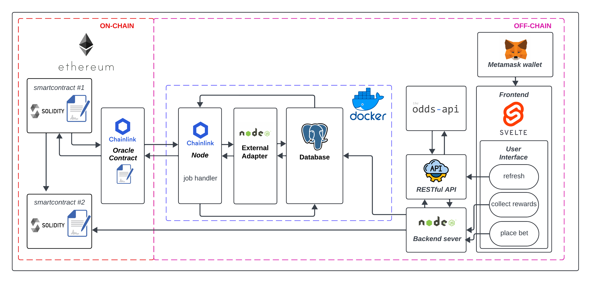

## Overview

A dApp for betting on real sports match outcomes, settled on-chain against real-world odds and
results pulled in through a Chainlink oracle rather than a centralized bookmaker.


<p class="-mt-4 text-center text-xs text-muted">On-chain betting contracts talk to a Chainlink oracle node; the node's external adapter reads match odds and results from Postgres. The Svelte frontend (via MetaMask) and a Node.js backend handle placing bets and refreshing odds.</p>

## Problem

Settling a bet on-chain needs a source of truth for match odds and results that neither side can
manipulate, and a payout that can't quietly favor the house. A single bookmaker's odds can also be
skewed by one outlier price. The contract itself has no way to know who won a match; it needs
real-world data delivered in a way it can trust.

## Approach

- `BettingContract.sol` (Solidity, OpenZeppelin `AccessControl` + `ReentrancyGuard`) holds bets per
  match, caps bet size, blocks a second bet on the same match from the same address, and gates
  payouts to an `ORACLE_ROLE`.
- Odds are pulled from [the-odds-api.com](https://the-odds-api.com/), averaged per outcome across
  bookmakers, and outliers (any single bookmaker's odds over 15) are excluded from the average so
  one mispriced line can't skew the payout odds. Matches, scores, and odds are stored in Postgres
  via Sequelize models (`Match`, `Score`, `Bookmaker`, `Market`, `Outcome`).
- Match outcomes reach the contract through a real Chainlink oracle flow: `FetchFromDB.sol` fires a
  direct-request job, a Chainlink node picks it up and calls a Node.js external adapter, the
  adapter reads completed matches straight from Postgres and works out the winner by comparing
  each team's score, and the encoded result is delivered back on-chain to `fulfill()`, which then
  forwards it into `BettingContract.notifyMatchWinners()`:

  ```solidity
  function requestCompletedMatches() public onlyOwner returns (bytes32 requestId) {
      Chainlink.Request memory req = buildChainlinkRequest(
          jobId,
          address(this),
          this.fulfill.selector
      );
      return sendChainlinkRequest(req, fee);
  }

  function fulfill(
      bytes32 _requestId,
      string[] memory _matchIds,
      uint8[] memory _outcomes
  ) public recordChainlinkFulfillment(_requestId) {
      require(_matchIds.length == _outcomes.length, "Mismatched array lengths");
      delete matchOutcomes;

      for (uint256 i = 0; i < _matchIds.length; i++) {
          if (!notifiedMatches[_matchIds[i]]) {
              matchOutcomes.push(MatchOutcome({
                  matchId: _matchIds[i],
                  winningOutcome: _outcomes[i]
              }));
          }
      }
      emit RequestCompletedMatches(_requestId, matchOutcomes);
  }
  ```
- `distributeWinnings()` splits the pot proportionally by each bet's locked-in odds, deducts a
  configurable tax (5% by default), and pays winners directly in the same transaction.
- Svelte frontend, MetaMask for wallet connection, and a small Node/Express backend for refreshing
  odds and submitting the `requestBet`/`notifyMatchWinners` transactions.

## Findings

- `distributeWinnings()` pays every winner with `.transfer()` inside a loop and no try/catch, so if
  even one winner is a contract whose `receive()` reverts, the whole payout for that match reverts
  and nobody gets paid until it's resolved. A pull-based withdrawal pattern (winners claim their
  own payout) would avoid that single point of failure.
- There are two separate paths to trigger `notifyMatchWinners()`: the actual Chainlink oracle flow
  above, and a plain backend script that signs the same transaction with a hot wallet key via
  web3.js. The second one is a convenient shortcut for local development, but it quietly
  re-centralizes the exact trust the oracle path exists to remove.
- One bet per address per match is enforced on-chain (`userHasBetOnMatch`), which is simple but
  means no adding to a position or partial cash-out once a bet is placed.

## Outcome

A working end-to-end flow, place a bet in the Svelte app, have real match results reach the
contract through an actual Chainlink oracle round-trip, and get paid out automatically, that won
the BCOLN Challenge Award for Best Distributed dApp, 2024.