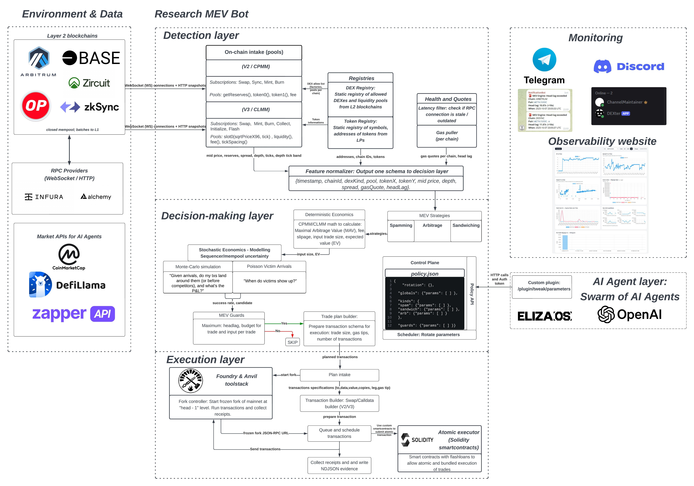
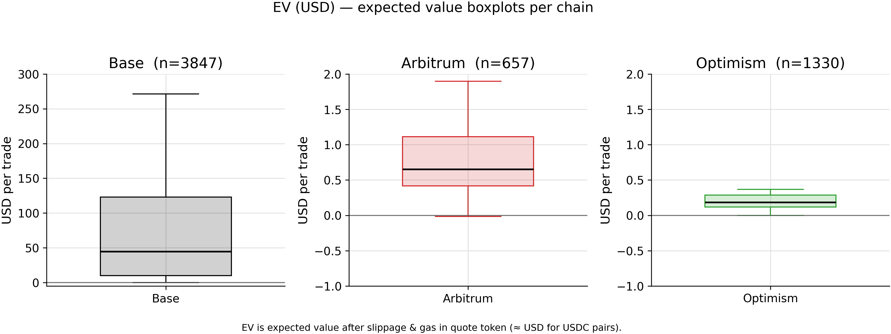
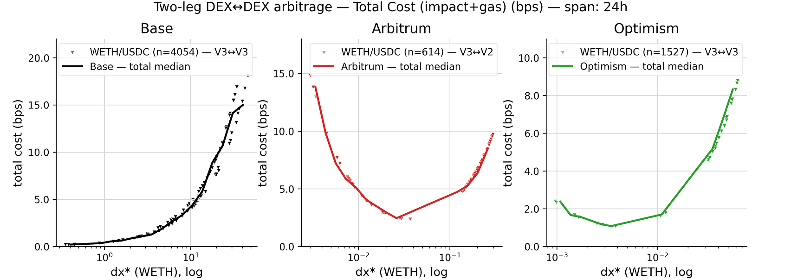
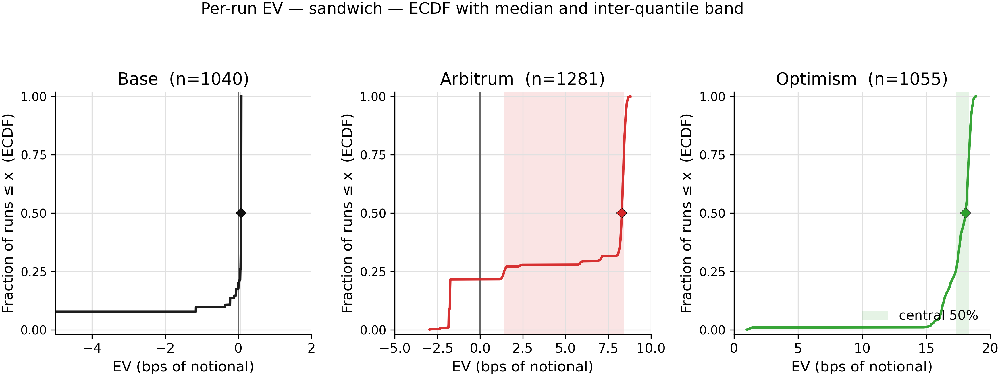
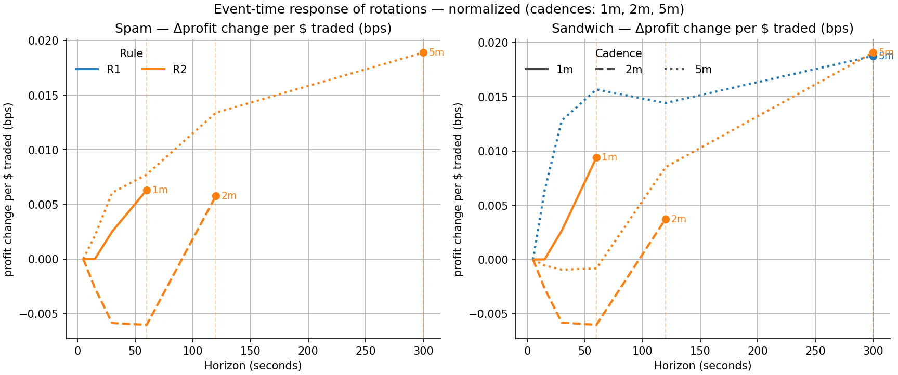

## Overview

A research system for studying Maximal Extractable Value (MEV) on L2 rollups (Base,
Arbitrum, Optimism) and the practical role AI agents can play in running it: a live
mainnet liquidity-pool scanner, a deterministic + stochastic profitability engine for
three MEV strategies, and a swarm of two ElizaOS agents that tune the engine's
parameters through an authenticated policy API instead of touching execution logic
directly. This is the core of a three-repo system (the [AI Orchestration Framework](/projects/ai-orchestration-framework/)
covers the agent layer, the [MEV Monitoring Dashboard](#mev-monitoring-dashboard) below
covers observability) and is the basis of the research paper:
"Design and Evaluation of AI Agents for MEV Extraction on Rollups."

<a href="/images/mev-system-architecture.jpeg" target="_blank" rel="noreferrer"></a>
<p class="-mt-4 text-center text-xs text-muted">Click to open full size. Detection layer watches pools over WebSocket and normalizes state; decision-making layer prices opportunities and runs them through a Monte Carlo L2 microstructure model; execution layer plans an Anvil/Foundry fork check before submission, live submission is the current focus (see Future Work). policy.json is what the AI agent layer reads and writes.</p>

- **Data ingestion**: persistent WebSocket subscriptions to CPMM (`Sync`/`Swap`) and
  CLMM (`Swap`/`Mint`/`Burn`) pool events across Base, Arbitrum, and Optimism,
  normalized into one in-memory pool-state schema with a `headlag` freshness check
  on every update.
- **Deterministic economics**: closed-form CPMM arbitrage math (optimal trade size,
  Maximal Arbitrage Value, EV net of gas) plus CLMM tick-aware pricing, shared as the
  same profit function across all three MEV strategies.
- **Stochastic microstructure**: a Monte Carlo simulator of an FCFS L2 sequencer,
  latency jitter, tip-based priority time shifts, and Poisson-process victim arrivals,
  used to price sequencer spamming and sandwich attacks under realistic ordering
  uncertainty instead of assuming clean execution.
- **Policy control plane**: a single `policy.json` with explicit min/max/step bounds
  per parameter, exposed over an authenticated HTTP API rather than editable directly.
- **AI agent swarm (ElizaOS)**: Eliza reads/writes that policy via natural language
  through a custom plugin, Dexter is a read-only market-intel agent wired to
  CoinMarketCap/DeFiLlama/Zapper, and a rule-based rotator proposes bounded tweaks on
  a timer independent of either agent being prompted.
- **Execution layer**: a planned Anvil/Foundry fork check before submission; wiring up
  live mainnet submission is the current focus (see Future Work).
- **Observability**: an NDJSON evidence trail for every decision, guard rejection, and
  simulation, a Django monitoring dashboard, and Telegram alerting on headlag/error-rate
  thresholds.

## Problem

Rollups changed MEV's shape: a centralized sequencer controls ordering, most don't
expose a public mempool, and blocks land in hundreds of milliseconds to a few seconds.
That kills classic L1 searching (watch the mempool, outbid, front-run) but doesn't
eliminate MEV, it just shifts what's viable to strategies that don't need mempool
visibility, like cross-DEX arbitrage, or that try to route around the lack of a
mempool entirely, like spamming the sequencer with copies of a transaction. Whether
those L2-specific strategies are actually profitable once gas, AMM fees, and price
impact are accounted for, and whether an LLM-driven agent is fast/reliable enough to
run any part of that loop, wasn't well established going in.

## Approach

The engine is split into three layers, each independently testable and each with a single
responsibility.

### Detection layer

Subscribes to CPMM (`Sync`/`Swap`) and CLMM (`Swap`/`Mint`/`Burn`) pool events over a
single persistent WebSocket per chain rather than polling over HTTP, since re-establishing
an HTTP connection per RPC call adds latency that a rollup opportunity often doesn't
survive:

```typescript
const fSync = { address: addrsV2, topics: [TOPIC_SYNC] };
const lSync = (log: any) => handleSyncV2(ctx, log as ethers.Log);
provider.on(fSync, lSync);
ctx.subs.push({ filter: fSync, listener: lSync });

const fV3S = { address: addrsV3, topics: [TOPIC_V3_SWAP] };
const lV3S = (log: any) => handleSwapV3(ctx, log as ethers.Log);
provider.on(fV3S, lV3S);
```

Every update recomputes reserves, spot price, and depth for the affected pool in
memory, tags it with a `headlag` (how far behind the chain tip the data is), and drops
anything stale before it reaches the decision layer.

### Decision-making layer

Prices every candidate with closed-form CPMM math (deterministic economics), then
layers a stochastic L2 microstructure simulation on top for the two strategies where
execution order isn't guaranteed.

**Deterministic economics** finds the optimal trade size and Maximal Arbitrage Value
(MAV) between two pools in closed form, then expected value (EV) subtracts a
success-probability-weighted gas cost:

```typescript
// Buy on the cheaper pool, sell on the dearer one; f/g are the two legs' LP fees.
const ratio = pAmm / (oneMinusF * oneMinusG * pCex);
const deltaXMax = xReserveX * (1 - Math.sqrt(ratio));
const term = Math.sqrt(oneMinusG * pCex) - Math.sqrt(pAmm / oneMinusF);
const mavY = Math.max(0, xReserveX * oneMinusF * (term * term));

// EV = MAV * P(success) - gas, gated at > 0 before anything is marked "ready"
export function expectedValueY(mavY: number, pSuccess: number, gasFeeY: number) {
  return mavY * pSuccess - (gasFeeY || 0);
}
```

**Stochastic economics** exists because a rollup's centralized sequencer, latency
jitter, and (for sandwich attacks) an unknown victim arrival time mean "will this
land in the right order" isn't a yes/no. Sequencer spamming and sandwich attacks are
evaluated with a Monte Carlo simulator: sample a network latency and a tip-based time
shift for every copy of the frontrun/backrun transaction, let a modeled FCFS
sequencer order them by effective arrival time, sample whether a victim (Poisson
arrival process, lognormal size fit to real swap data) lands inside the resulting
gap, and repeat thousands of times to get a success rate and expected EV for that
policy:

```typescript
for (let t = 0; t < trials; t++) {
  const ord = sampleOrderingGapMs(policy, cfg);
  if (ord.timeBackMs == null) { /* copies never landed in order, pay gas, continue */ }

  const gapMs = ord.timeBackMs - ord.timeFrontMs;
  const victimArrives = Math.random() < pVictimBetween(cfg.victimLambdaPerMs, gapMs);
  if (!victimArrives) { /* no one to sandwich this trial, pay gas, continue */ }

  const v = cfg.sampleVictimSize();
  const net = mavFromQ(policy.q) - (policy.nFront + policy.nBack) * cfg.gasCostPerTxY;
  sumEV += net;
}
```

Every parameter that shapes this (trade size, number of copies, tips, the sandwich
back-delay) lives in a single `policy.json`, with explicit min/max/step bounds per key
so neither a human nor an agent can push a value far enough to break the guardrails.

### Execution layer

Specified at the design level: verify a trade plan against a frozen local Anvil fork
of the target chain, then submit via RPC. Live submission was deliberately sequenced
after the measurement work, wiring up sequencer spamming or sandwich transactions
against real users isn't something to rush, and it's the current focus, covered in
Future Work below.

### AI agent integration

Two ElizaOS agents (covered in full on the [AI Orchestration Framework](/projects/ai-orchestration-framework/)
page) sit outside this pipeline entirely and talk to it only through an authenticated
Policy API: Eliza reads/writes `policy.json` on natural-language commands, and a
rule-based rotator can also propose bounded tweaks on a timer, independent of whether
anyone is chatting with the agent:

```typescript
// One of three hardcoded rotation rules: negative EV -> push for more profit.
export function r2_neg_ev_push_profit(pol: Policy, s: StatSnapshot): Proposal[] {
  if (s.ev < 0 && numParam(pol.kinds[s.kind].params.TIP_FRONT)) {
    const P = pol.kinds[s.kind].params.TIP_FRONT;
    return [{ path: `kinds.${s.kind}.params.TIP_FRONT`, next: clamp(P.value + P.step, P.min, P.max),
              reason: `R2: EV=${s.ev.toFixed(2)} negative, raise TIP_FRONT to win more priority.` }];
  }
  return [];
}
```

## Findings

**Cross-DEX arbitrage is the strategy that actually works**, and it scales with
liquidity depth, not with per-unit edge:


<p class="-mt-4 text-center text-xs text-muted">Base's median (~$45/trade, n=3,847) dwarfs Arbitrum (~$0.65, n=657) and Optimism (~$0.18, n=1,330). In basis points the three chains land within a few bps of each other, the USD gap is almost entirely explained by Base's deeper pools allowing a bigger trade size, not a better edge per dollar.</p>

- Because it's a single atomic two-leg trade, it can be flash-loan funded: size isn't
  capped by the searcher's own capital, only by how much the route can absorb before
  slippage eats the spread.
- Total execution cost (impact + gas) versus trade size is U-shaped on Arbitrum and
  Optimism: too small and gas dominates (up to ~40% of cost at the smallest sizes
  tested), too large and AMM slippage takes over, and the bottom of the U is the
  actual cost-minimizing trade size.

  
  <p class="-mt-4 text-center text-xs text-muted">Base never reaches its cost floor in this window (deep pools mean gas is negligible at any tested size), while Arbitrum and Optimism clearly bottom out, telling a searcher exactly where to size a trade.</p>

**Sequencer spamming (many copies of the same tx racing an FCFS queue) sits close to
break-even on all three chains.** It's non-atomic (each copy is its own transaction,
so it can't be wrapped in one flash-loaned bundle), which makes it both capital- and
gas-intensive for an edge that basis-point analysis shows is nearly identical across
chains, deeper pools just mean a bigger loss or win, not a better rate.

**Sandwich attacks show a real, if modest, positive EV**, and unlike spamming they
can be done atomically with a flash loan (borrow, frontrun, backrun, repay, all in
one transaction that reverts cleanly if it fails):


<p class="-mt-4 text-center text-xs text-muted">Arbitrum's median sits around 8 bps of notional with a wide spread; Base is close to flat; Optimism's distribution is the tightest and most skewed positive. These numbers are an upper bound: the simulator assumes a neutral sequencer with no pattern-based filtering and no competing searchers, both of which a real mainnet sequencer could apply against exactly this kind of transaction pattern.</p>

**AI agent parameter rotations barely move EV instantly, but compound over time.**
Each single rotation (Eliza or the rule-based rotator nudging a gas tip, a copy count,
or the sandwich back-delay) sits close to zero effect on the very next measurement:


<p class="-mt-4 text-center text-xs text-muted">Tracking the same rotation forward in time instead of just the instant after it: a 5-minute cadence delivers the largest per-rotation lift for both strategies, while 2-minute rotations dip negative before recovering. Single tweaks look like noise; the cumulative drift over minutes is where the signal is.</p>

- The practical read: an LLM-driven agent is a poor fit for anything latency-critical
  (block times of a few hundred milliseconds to a couple of seconds leave no room for
  an API round-trip to an LLM), but it's a good fit for exactly what it was used for
  here, safe, auditable, occasional parameter tuning, kept behind an API so a bad
  agent output at worst gets rejected by the policy bounds rather than touching a
  wallet.

## Risks & Limitations

- Every result here is a ceiling, not a floor: the simulator models a neutral FCFS
  sequencer with no pattern-based filtering, and no other searchers competing for the
  same opportunity. A real sequencer operator can (and, per the profitability of
  doing so, probably would) rate-limit or reorder obvious spam patterns from a single
  address, which this system doesn't account for.
- Sequencer centralization is itself a risk to anyone running this live: a single
  operator controls inclusion and ordering outright, and depending on capital left in
  flight, a stalled or malicious sequencer is a direct loss vector, not just a
  performance problem.

## Future Work

**Take the MEV bot from research to a live searcher.** 

- **Rewrite the hot path in Rust on Tokio.** The detection-to-decision path is
  currently TypeScript on a single-threaded event loop, fine for proving the
  economics out in simulation, not fine once the target is winning races measured
  in tens of milliseconds against latency incumbents sitting next to the sequencer.
  The pool-state ingestion and pricing loop is the first candidate for the rewrite.
- **Finish the execution layer.** The Anvil/Foundry fork pre-check is specified at
  design level; the gap left to close is actually signing and submitting to a real
  sequencer RPC, currently the single biggest difference between "research
  prototype" and "live searcher."
- **Go live with small real capital** on one or two L2s, starting with cross-DEX
  arbitrage since it's the strategy the simulation data actually supports (atomic,
  flash-loan fundable, EV-positive), not sequencer spamming or sandwich attacks.
- **Instrument the live run properly**: fill rate, revert rate, gas paid versus gas
  captured, where races were actually lost and why, and what the real latency budget
  looks like from the sequencer feed to inclusion.

## Outcome

A working, three-layer MEV research system that ran live against real mainnet
liquidity for three rollups, an EV-positive result for cross-DEX arbitrage, thin
break-even economics for sequencer spamming, modest positive EV for sandwich attacks,
and an AI agent swarm that safely tunes the whole thing through an authenticated
policy API with a measurable, if slow-compounding, positive effect on profitability.
Presented at BCK25, Mumbai, and the empirical basis for the master's thesis "Design
and Evaluation of AI Agents for MEV Extraction on Rollups."

## MEV Monitoring Dashboard

A companion tool for watching the MEV engine run: a lightweight Django dashboard that visualizes
NDJSON logs in real time and exposes an admin panel for remote control (pause/resume/stop) via
shared flag files, with no database required.

Repo: [MEV-Monitoring-Dashboard](https://github.com/Szczepoo13/MEV-Monitoring-Dashboard)
