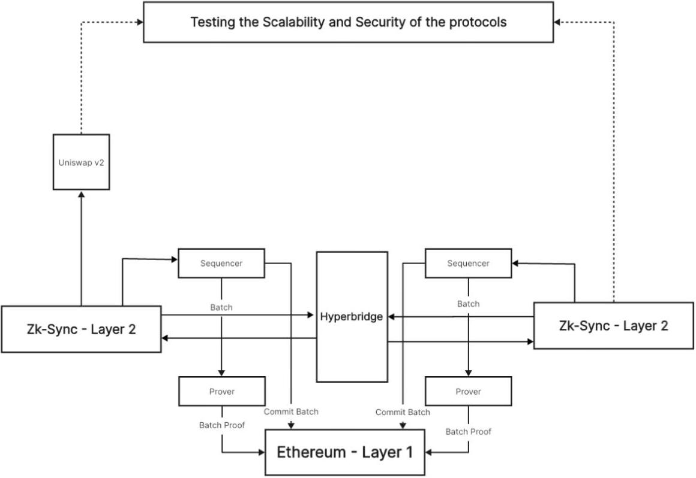
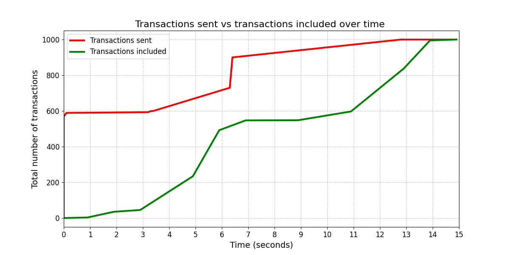
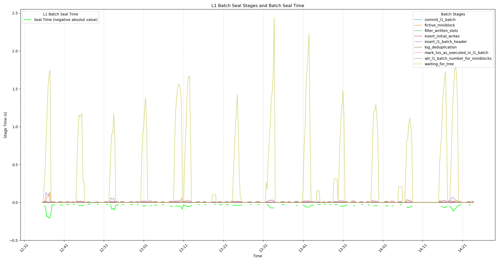

## Overview

A load-testing and interoperability harness for a self-hosted ZK rollup setup. We stood up two
independent zkSync chains (Elastic Chain stack, each with its own sequencer, prover, and Reth
execution node, anchored to Ethereum Sepolia as L1) connected by a Hyperbridge contract for
cross-rollup liquidity sharing, forked Uniswap V2 onto one of them, then built a Python transaction
generator to flood it with real AMM swaps and measure how the rollup actually behaves under load,
using not token transfers but the gas-heavy contract calls DeFi apps actually send.

## Problem

Public TPS figures for rollups (ZKsync's claimed 2,000 TPS, Arbitrum's 40,000+ in synthetic
benchmarks) are almost always measured with minimal-payload transactions like plain transfers.
That number says little about what a DEX under real load will see, since a `swapExactTokensForTokens`
call touches multiple storage slots, runs AMM math, and updates two token balances. It costs far
more gas than a transfer and stresses the sequencer/prover differently, so we wanted a benchmark
that reflects that.

## Approach

Two independent zkSync chains, each with its own sequencer and prover, linked by a Hyperbridge contract for cross-rollup liquidity. Only one chain runs the forked Uniswap V2 deployment; both settle batches and validity proofs to Ethereum L1.

- Deployed two independent zkSync chains from the Elastic Chain codebase (not a fork of the public
  zkSync network, but separate genesis blocks, each with its own sequencer, prover, and Reth execution
  node), anchored to Ethereum Sepolia.
- Used a Hyperbridge smart contract connecting the two chains, using Merkle proofs to verify
  and settle cross-rollup transfers so liquidity locked on one chain could be used from the other.
- Forked Uniswap V2 onto one of the two chains and created ERC-20 liquidity pools, porting the
  contracts to a newer Solidity version and adjusting for zkSync's EVM-compatible-but-not-EVM-equivalent
  execution model along the way. That surfaced a `foundry-zksync` compiler-toolchain gap that I reported
  upstream (see [discussion #740](https://github.com/zkSync-Community-Hub/zksync-developers/discussions/740)),
  later shipped as `suppressedErrors` support.
- Built the load generator in Python: 50 accounts derived from one mnemonic, each pre-approved on the pool and firing 20
  swaps apiece via `swapExactTokensForTokens`, for 1,000 transactions per run.
- Ran up to 5 generator instances in parallel, each bound to a distinct IP (via `iptables`) to
  emulate distributed traffic and avoid a single RPC endpoint becoming the bottleneck, talking to
  the node over a WebSocket (port 3051) instead of HTTP to cut round-trip overhead.
- Logged every tx hash and sender per instance, merged the logs, and wrote a blockchain parser that
  batch-queries the chain for inclusion block, timestamp, and block size so send-time and
  inclusion-time could be joined for latency analysis.
- Deployed a Dockerized local block-explorer (indexer, API, and Postgres-backed frontend) and
  bridge-portal DApp so both chains and cross-rollup transfers could be inspected via MetaMask
  instead of raw CLI calls.

## Tech Stack

- **Rollup infra**: zkSync Elastic Chain stack, deployed and managed via Matter Labs' `zkstack`/`zk-inception`
  CLI; two independent chains, each with its own sequencer, prover, and Reth execution node.
- **Contracts**: Solidity 0.8.x, compiled with Matter Labs' `zkSolc` and deployed/tested with
  `foundry-zksync` (a Rust-based fork of Foundry), including patching around the compiler-toolchain
  bug above.
- **Interoperability**: a Hyperbridge contract using Merkle proofs to verify and settle
  cross-rollup transfers between the two chains.
- **Observability**: Grafana + Prometheus, auto-provisioned in Docker; custom `rate()`-based
  Grafana alert rules for TPS-spike detection, piped to a Microsoft Teams webhook.
- **Stress-test tooling**: Python transaction generator over WebSocket, `iptables`-based multi-IP
  traffic distribution, and a Python/Pandas log parser for the latency and TPS analysis.
- **Supporting services**: Dockerized local zkSync block-explorer (indexer + API + frontend,
  Postgres-backed) and bridge-portal DApp, MetaMask for wallet interaction, all on Sepolia as L1.

## Findings

| Instances run | Transactions | Time [s] | TPS |
|---|---|---|---|
| 1 | 200 | 1 | 200.00 |
| 2 | 400 | 2 | 200.00 |
| 3 | 600 | 7 | 85.71 |
| 4 | 800 | 13 | 61.54 |
| **5** | **1,000** | **14** | **71.43** |

Peak TPS is achieved with a single generator instance; throughput dips as sequencer load increases from parallel instances, then recovers by 5.

- Peak sustained throughput was **71.43 TPS** with 5 parallel generators (1,000 swaps in 14s),
  against roughly 15–23 TPS on Ethereum L1 for comparable transactions (3–4x higher), with peaks of
  98.4 TPS mid-run.
- Throughput didn't scale linearly with generator count: 1–2 instances actually hit 200 TPS, but
  3–5 instances saw throughput drop to 61–86 TPS before recovering to 71 at 5, and pushing past 5
  instances made the sequencer unstable enough to fail block production outright, a clear single
  point of failure.
- Median soft-finality latency (inclusion in an L2 miniblock) was about 2.5s, with over 50% of swaps
  included inside that window; full inclusion of the whole 1,000-tx burst completed by 15s.

An initial burst of ~600 swaps outpaces the sequencer, which catches up and reaches full inclusion of all 1,000 transactions by 15 seconds.

- Hard finality (batch + validity proof verified on L1) took 10–20 minutes depending on prover
  availability and L1 congestion, a large gap between "the user sees it confirmed" and
  "it's cryptographically final," relevant for anything settlement-critical like liquidations.
- The sequencer visibly thrashed between ingesting transactions and sealing/submitting batches,
  which showed up as block utilization crashing right after bursts of high utilization.
- Merkle tree updates dominated L1 batch-sealing time (up to 2.44s per batch) while every other
  sealing stage (header insertion, log dedup, initial writes) finished in under 250ms.
- Miniblocks averaged ~9 transactions vs. ~31 per L1 batch, a >3x gap showing the tension between
  keeping L2 latency low and amortizing L1 submission costs over a full batch.

The waiting_for_tree (Merkle tree update) stage repeatedly spikes to 1.5–2.44s while every other sealing stage stays near zero.

## Security Implications

The stress test wasn't just a throughput number. It exposed two trust/security trade-offs the
paper flags explicitly:

1. **Soft finality isn't a security guarantee.** A swap looks "confirmed" as soon as the sequencer
   includes it in an L2 miniblock (~2.5s median), but it's only provisional until the batch and its
   validity proof are posted and verified on L1 (hard finality, which took 10–20 minutes in our
   runs). Until then, a swap can still be reversed if its batch never lands. Anything settlement-critical
   (liquidations, cross-chain bridges, oracle-triggered logic) that treats soft finality as final is
   trusting the sequencer's honesty, not cryptography.
2. **The sequencer is a single point of failure, twice over.** Each chain ran its own sequencer and
   prover, and pushing past 5 concurrent generator instances was enough to destabilize the stressed
   chain's sequencer and stall its block production entirely. Because the Hyperbridge depends on both
   chains staying live to settle cross-rollup transfers, either sequencer going down breaks bridging
   between them, not just local activity. That's not just a scalability ceiling; it's a
   centralization risk: whoever (or whatever) controls a sequencer can censor or halt its chain, and
   there's no fallback until rollups move to decentralized/multi-sequencer designs.

## Outcome

A working, reproducible benchmark of a real ZK rollup + AMM stack rather than a synthetic
transfer-only number: 72 TPS sustained on gas-intensive swaps, sub-2.5s soft finality, and a
concrete demonstration that the sequencer is the practical bottleneck (fragile past 5 concurrent
generators), the core empirical basis for our paper, ["Scaling DeFi with ZK Rollups"](https://ieeexplore.ieee.org/abstract/document/11466501),
presented at BCK25 conference in Zurich, Switzerland and published in IEEE ICDLT 2025. Code and the Uniswap modifications are public in the
[repo](https://github.com/Szczepoo13/zkSync-TPS-Benchmark) for reproduction.